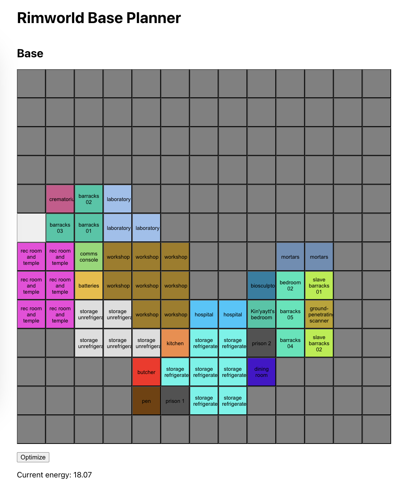
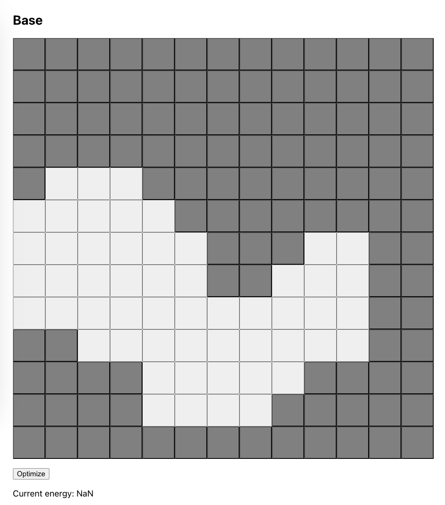
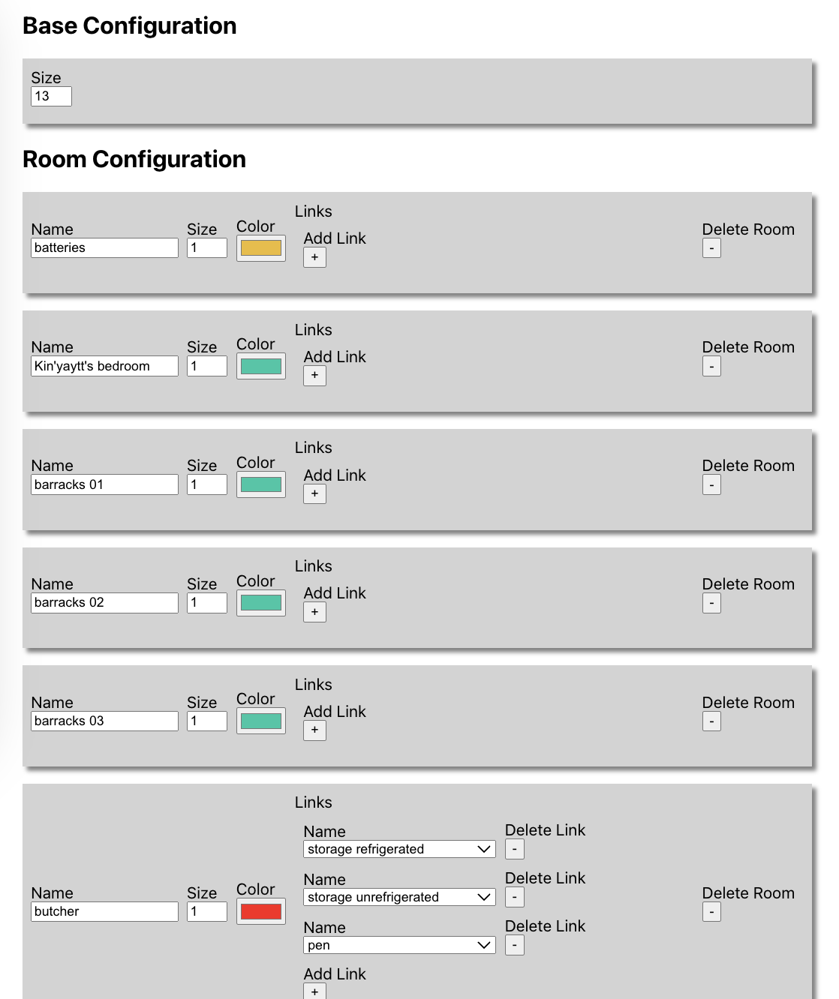

# rimworld-base-planner

This tool optimizes a [Rimworld](https://rimworldgame.com/) base layout. It uses [simulated annealing](https://en.wikipedia.org/wiki/Simulated_annealing) to settle on an approximate global optimum that minimizes colonist traffic and maximizes productivity.



# Setup

1. Install dependencies.
    ```
    npm ci
    ```

# Usage

1. Run the program.
    ```
    npm start
    ```

1. Enable usable cells. My preference is for each cell to correspond to a 5x5 group of tiles, but the scale is up to you.
    

1. Add rooms. Configure their sizes, and which other rooms they should be near in order to minimize traffic.
    

1. Optimize.
    
